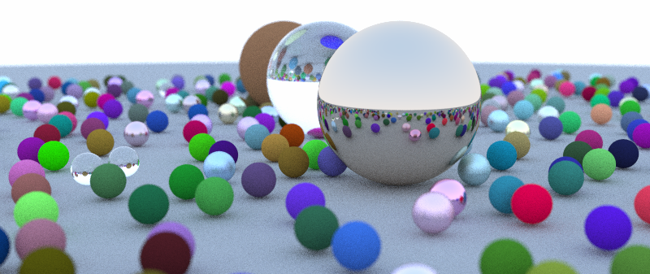

# Ray Tracing in One Weekend — Odin

An implementation of the [Ray Tracing in One Weekend](https://raytracing.github.io/) series
in the [Odin programming language](https://odin-lang.org/), extended with a live Raylib UI,
scene editing, and a GPU compute-shader path.



## Features

- **CPU path tracer** — multi-threaded, BVH-accelerated, progressive tile rendering
- **GPU path tracer** — OpenGL 4.3 compute shader with progressive accumulation (`-gpu` flag)
- **Live preview** — Raylib window with real-time texture upload as tiles / samples complete
- **Scene editor** — interactive 3D viewport; add, move, and delete spheres; three material types
- **Cross-platform** — Linux (OpenGL 4.3+), Windows (OpenGL 4.3+), macOS (CPU fallback; OpenGL capped at 4.1)

## Getting Started

### Prerequisites

- [Odin compiler](https://odin-lang.org/) (with full vendor collection including Raylib)
- A C linker (`clang` or `gcc` on Linux/macOS, MSVC on Windows)

### Build

```sh
mkdir -p build
odin build . -collection:RT_Weekend=. -debug -out:build/debug
```

### Run

```sh
# CPU render (default): 800×450, 10 samples, 10 spheres
./build/debug

# Custom resolution and sample count
./build/debug -w 1280 -h 720 -s 50

# GPU compute shader path (requires OpenGL 4.3+)
./build/debug -gpu -s 100

# All flags
./build/debug -w <int> -h <int> -s <samples> -n <spheres> -c <threads> [-gpu]
```

| Flag | Description | Default |
|------|-------------|---------|
| `-w` | Image width in pixels | 800 |
| `-h` | Image height in pixels | 450 |
| `-s` | Samples per pixel | 10 |
| `-n` | Number of random spheres | 10 |
| `-c` | CPU thread count | physical cores |
| `-gpu` | Use GPU compute shader | off |

## Project Layout

```
.
├── main.odin               Entry point — CLI parsing, scene setup, launches UI
├── util/                   CLI args, system info, Xoshiro256++ RNG
├── raytrace/               Core path tracer (CPU + GPU)
│   ├── camera.odin         Parallel render session, tile dispatch, start_render_auto
│   ├── hittable.odin       Sphere/Cube, AABB, recursive + flat BVH
│   ├── material.odin       Lambertian, Metallic, Dielectric scatter
│   ├── vector3.odin        Vec3 math, ray, ray_color_linear
│   ├── gpu_types.odin      GPUBackend, GPUSphere, LinearBVHNode, GPUCameraUniforms
│   ├── gpu_backend.odin    OpenGL compute backend (Linux/Windows/macOS loaders)
│   ├── gpu_renderer.odin   GpuRendererApi vtable + create_gpu_renderer factory
│   ├── raytrace.odin       setup_scene (default scene), write_buffer_to_ppm
│   ├── scene_build.odin    build_world_from_scene
│   ├── scene_io.odin       load_scene / save_scene (JSON)
│   └── profiling.odin      Zero-cost timing (PROFILING_ENABLED flag)
├── ui/                     Raylib window, panels, scene editor
│   ├── app.odin            App struct, FloatingPanel, run_app event loop
│   ├── ui.odin             Shared draw primitives, panel chrome, colors
│   ├── stats_panel.odin    Tile/sample progress, elapsed time
│   ├── edit_view_panel.odin 3D orbit viewport, toolbar, drag-float properties
│   └── …                   Other panels (log, camera, object props, preview port)
├── scene/                  Shared scene types (SceneSphere, CameraParams, MaterialKind)
└── assets/
    ├── fonts/              Inter-Regular.ttf (SDF UI text, optional)
    └── shaders/
        ├── raytrace.comp   GLSL 430 compute shader (GPU path tracer)
        └── sdf.fs          SDF text rendering shader
```

## Architecture

### Render Session API

Three procs in `raytrace/camera.odin` manage the non-blocking render lifecycle:

| Proc | Role |
|------|------|
| `start_render_auto(cam, world, threads, use_gpu)` | Builds BVH, optionally tries GPU, spawns CPU threads. Returns immediately. |
| `get_render_progress(session) -> f32` | Returns 0.0–1.0. Safe to call from any thread. |
| `finish_render(session)` | Joins CPU threads **or** destroys GPU renderer; frees BVH. |

### GPU Renderer Vtable

`raytrace/gpu_renderer.odin` defines a thin abstraction layer:

```odin
GpuRendererApi :: struct {
    init:        proc(cam, world, bvh, total) -> (rawptr, bool),
    dispatch:    proc(state),
    readback:    proc(state, out: [][4]u8),
    destroy:     proc(state),
    get_samples: proc(state) -> (cur, tot: int),
}
```

`create_gpu_renderer` is the platform-aware factory. It currently tries the OpenGL
backend on Linux, Windows, and macOS; has commented stubs for future Metal (macOS)
and DirectX 12 / Vulkan (Windows) backends.

### Platform Behavior

| Platform | GPU today | Future |
|----------|-----------|--------|
| Linux | OpenGL 4.3 (GLX) | Vulkan |
| Windows | OpenGL 4.3 (WGL) | DirectX 12 / Vulkan |
| macOS | CPU fallback (OpenGL capped at 4.1) | Metal |

### CPU Path

1. BVH built once (`build_bvh` + `flatten_bvh` → flat `[]LinearBVHNode`)
2. Image divided into 32×32 tiles; atomic counter dispatches tiles to N threads
3. Each thread has its own Xoshiro256++ RNG; writes to non-overlapping buffer regions

### GPU Path

1. Same BVH array uploaded to an SSBO
2. One `DispatchCompute(W/8, H/8, 1)` per frame — each invocation traces one sample for one pixel
3. Accumulation SSBO divided by sample count on readback; gamma-corrected to `[][4]u8`

## Materials

| Type | Odin struct | Behaviour |
|------|-------------|-----------|
| Lambertian | `lambertian` | Diffuse — cosine-weighted hemisphere scatter |
| Metallic | `metallic` | Specular reflection + fuzz perturbation |
| Dielectric | `dielectric` | Refraction / Fresnel reflection (glass, water) |
