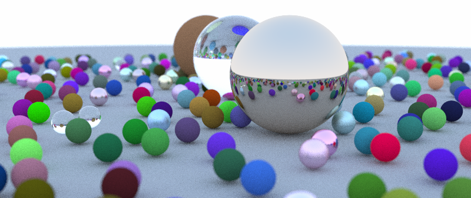

# Ray Tracing in One Weekend — Odin

An implementation of the [Ray Tracing in One Weekend](https://raytracing.github.io/) series
in the [Odin programming language](https://odin-lang.org/), extended with a live
[Dear ImGui](https://github.com/ocornut/imgui) docking UI, scene editing, and a GPU
compute-shader path.



## Features

- **CPU path tracer** — multi-threaded, BVH-accelerated, progressive tile rendering
- **GPU path tracer** — OpenGL 4.3 compute shader with progressive accumulation (`-gpu` / `-backend gpu`)
- **Backend abstraction** — pluggable `RenderBackendApi` vtable; CPU and OpenGL ship today, Vulkan planned
- **Dear ImGui docking UI** — native docking, undockable panels, menu bar, ImGui Metrics window
- **Live preview** — Raylib window with real-time texture upload as tiles / samples complete
- **Scene editor** — interactive 3D viewport; add, move, and delete spheres; three material types
- **Scene-load light safety** — imported scenes with no emissive materials and black/missing background auto-fallback to white background
- **Cross-platform** — Linux (OpenGL 4.3+), Windows (OpenGL 4.3+), macOS (CPU fallback; OpenGL capped at 4.1)

## Getting Started

### Prerequisites

- [Odin compiler](https://odin-lang.org/) (with full vendor collection including Raylib)
- A C++ linker (`clang++` or `g++` on Linux/macOS, MSVC on Windows) — required to link the Dear ImGui static library
- Python 3 — used once by `make imgui` to build the Dear ImGui static library

### Build

**Using the Makefile (recommended):**

```sh
# One-time: build the Dear ImGui static library (required after first clone or submodule update)
make imgui

make debug    # Debug build → build/debug
make release  # Optimized release build → build/release
```

**Manual build:**

```sh
mkdir -p build
odin build . -collection:RT_Weekend=. -debug -out:build/debug
```

Release builds use `-o:speed -no-bounds-check` and disable profiling/verbose output (`-define:PROFILING_ENABLED=false -define:VERBOSE_OUTPUT=false`). Use `./build/release` to run the release binary.

### Run

```sh
# CPU render (default): 800×450, 10 samples, 10 spheres
./build/debug

# Or use the release binary for faster rendering
./build/release

# Custom resolution and sample count
./build/debug -w 1280 -h 720 -s 50

# GPU compute shader path (requires OpenGL 4.3+)
./build/debug -gpu -s 100
# or equivalently:
./build/debug -backend gpu -s 100

# All flags
./build/debug -w <int> -h <int> -s <samples> -n <spheres> -c <threads> [-gpu] [-backend cpu|gpu]
```

| Flag | Description | Default |
|------|-------------|---------|
| `-w` | Image width in pixels | 800 |
| `-h` | Image height in pixels | 450 |
| `-s` | Samples per pixel | 10 |
| `-n` | Number of random spheres | 10 |
| `-c` | CPU thread count | physical cores |
| `-gpu` | Use GPU compute shader (shorthand for `-backend gpu`) | off |
| `-backend` | Select render backend: `cpu`, `gpu` | `cpu` |

## Project Layout

```
.
├── main.odin               Entry point — CLI parsing, scene setup, launches editor
├── core/                   Shared types: SceneSphere, CameraParams, MaterialKind, Texture
├── util/                   CLI args, system info, Xoshiro256++ RNG, native file dialogs
├── raytrace/               Core path tracer (CPU + GPU)
│   ├── camera.odin         Parallel render session, tile dispatch, start_render_auto
│   ├── hittable.odin       Sphere/Quad, AABB, recursive + flat BVH
│   ├── material.odin       Lambertian, Metallic, Dielectric scatter
│   ├── vector3.odin        Vec3 math, ray, ray_color_linear
│   ├── render_backend.odin RenderBackendApi vtable, RenderBackend, backend helpers
│   ├── cpu_backend.odin    CPU tile renderer as a RenderBackend
│   ├── gpu_backend_adapter.odin  Wraps GpuRendererApi as a RenderBackend
│   ├── gpu_types.odin      GPUBackend, GPUSphere, LinearBVHNode, GPUCameraUniforms
│   ├── gpu_backend.odin    OpenGL compute backend (Linux/Windows/macOS loaders)
│   ├── gpu_renderer.odin   GpuRendererApi vtable + create_gpu_renderer factory
│   ├── raytrace.odin       setup_scene (default scene), write_buffer_to_png/ppm
│   ├── scene_build.odin    build_world_from_scene
│   └── profiling.odin      Zero-cost timing (PROFILING_ENABLED flag)
├── persistence/            Scene + config load/save (JSON)
├── editor/                 Dear ImGui docking UI + scene editor
│   ├── app.odin            App struct, run_app event loop, render lifecycle
│   ├── imgui_rl.odin       Raylib→ImGui platform bridge (NewFrame, Render, Setup, Shutdown)
│   ├── imgui_panel_vis.odin ImguiPanelVis — per-panel open/close bools
│   ├── imgui_panels_stub.odin DockSpace + menu bar + panel stub windows (migration in progress)
│   ├── panel_*.odin        Per-panel draw/update (being migrated to ImGui — see below)
│   ├── ui_*.odin           Legacy Raylib UI infrastructure (removed after migration)
│   ├── core_*.odin         Framework-agnostic logic: commands, history, scene state
│   └── edit_view_*.odin    3D viewport: orbit camera, picking, nudge, input state machine
├── vendor/
│   └── odin-imgui/         Dear ImGui v1.91.7-docking — Odin bindings + static lib
│                           Build with: make imgui  (runs python3 build.py once)
└── assets/
    ├── fonts/              Inter-Regular.ttf (SDF UI text, optional)
    └── shaders/
        ├── raytrace.comp   GLSL 430 compute shader (GPU path tracer)
        └── sdf.fs          SDF text rendering shader
```

## Architecture

### Render Backend Abstraction

`raytrace/render_backend.odin` defines a unified `RenderBackendApi` vtable that
both CPU and GPU renderers implement. The editor and headless paths use this
interface exclusively — no backend-specific branching:

```odin
RenderBackendApi :: struct {
    tick:           proc(state),              // advance one unit of work
    readback:       proc(state, out: [][4]u8), // copy pixels (gamma-corrected RGBA)
    final_readback: proc(state, out: [][4]u8), // blocking readback for last sample
    get_progress:   proc(state) -> f32,        // 0.0–1.0
    get_samples:    proc(state) -> (int, int), // (current, total)
    get_timings:    proc(state) -> (i64, i64), // (dispatch_ns, readback_ns)
    reset:          proc(state),               // restart without rebuild
    finish:         proc(state, session),       // join/cleanup
    destroy:        proc(state),               // free memory
}
```

To add a new backend (e.g. Vulkan): implement these procs, declare a
`MY_BACKEND_API :: RenderBackendApi{...}` constant, and add a branch in
`start_render_auto()`. The editor needs zero changes.

### Render Session API

Three procs in `raytrace/camera.odin` manage the non-blocking render lifecycle:

| Proc | Role |
|------|------|
| `start_render_auto(cam, world, threads, use_gpu)` | Builds BVH, creates the appropriate `RenderBackend`, returns immediately. |
| `get_render_progress(session) -> f32` | Delegates to `backend_get_progress`. Returns 0.0–1.0. |
| `finish_render(session)` | Delegates to `backend_finish`. Joins threads or destroys GPU state. |

### GPU Renderer Vtable (internal)

`raytrace/gpu_renderer.odin` defines a lower-level `GpuRendererApi` used by
GPU-specific backends. `gpu_backend_adapter.odin` wraps it as a `RenderBackendApi`
so the rest of the codebase only sees the unified interface.

### Platform Behavior

| Platform | GPU today | Future |
|----------|-----------|--------|
| Linux | OpenGL 4.3 (GLX) | Vulkan (`vendor:vulkan`) |
| Windows | OpenGL 4.3 (WGL) | DirectX 12 / Vulkan |
| macOS | CPU fallback (OpenGL capped at 4.1) | Metal |

Odin ships with official Vulkan bindings (`import vk "vendor:vulkan"`). A Vulkan
compute backend would implement `RenderBackendApi` and plug in alongside OpenGL.

### CPU Path

1. BVH built once (`build_bvh` + `flatten_bvh` → flat `[]LinearBVHNode`)
2. Image divided into 32×32 tiles; atomic counter dispatches tiles to N threads
3. Each thread has its own Xoshiro256++ RNG; writes to non-overlapping buffer regions

### GPU Path

1. Same BVH array uploaded to an SSBO
2. One `DispatchCompute(W/8, H/8, 1)` per frame — each invocation traces one sample for one pixel
3. Accumulation SSBO divided by sample count on readback; gamma-corrected to `[][4]u8`

## Materials

| Type | Odin struct | Behaviour |
|------|-------------|-----------|
| Lambertian | `lambertian` | Diffuse — cosine-weighted hemisphere scatter |
| Metallic | `metallic` | Specular reflection + fuzz perturbation |
| Dielectric | `dielectric` | Refraction / Fresnel reflection (glass, water) |

## Cornell Box + Tests

- Built-in example scene: `Examples -> Cornell Box (empty)` now includes the full Cornell setup (room shell, emissive ceiling light, short/tall inner boxes).
- Scene-file version for regression tests: `tests/scenes/cornell_box.json`.
- Transform support for scene construction lives in `raytrace/transform.odin` (`Mat4`, TRS helpers, and `TransformStack`).
- Box geometry helper: `append_box` / `append_box_transformed` in `raytrace/quad.odin`.
- Automated checks:
  - `tests/aabb_transform_tests.odin` validates AABB edge cases and TRS round-trip math.
  - `tests/run_tests.sh debug` renders `smoke`, `materials`, and `cornell` scenes in headless mode.
